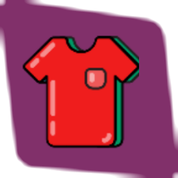
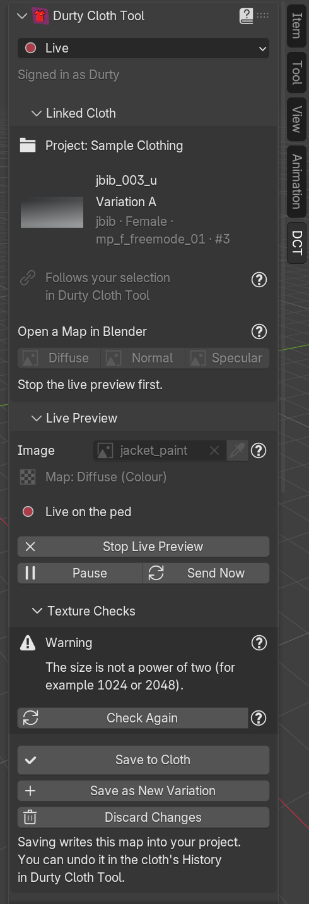

# Durty Cloth Tool Link for Blender

**Paint, model and fit GTA V clothing in Blender, and see it on the ped in Durty Cloth Tool while you work.**

[Install](#-installation) · [Getting started](#-getting-started) · [Documentation](https://docs.gta.clothing/creator-link/blender) · [Discord](https://discord.plebmasters.de) · [Releases](https://github.com/DurtyFree/durty-cloth-tool-blender/releases)

---

**Durty Cloth Tool Link** is the free, open-source Blender add-on for [Durty Cloth Tool](https://gta.clothing/), the
Windows app for creating GTA V clothing packs for FiveM and singleplayer. The add-on adds a **DCT** tab to Blender's
3D Viewport sidebar. Connected to Durty Cloth Tool on the same computer, it shows the texture you paint and the model
you edit on the cloth in Durty Cloth Tool's 3D Preview, and saves them into your project when you are happy with the
result. Its garment tools take a garment from Marvelous Designer or any FBX, OBJ or glTF file towards a game-ready
freemode cloth and add it to your Durty Cloth Tool project, and Custom Ped turns a character you made into a custom ped.

## ✨ Features

- 🎨 **Live Preview.** Paint a texture in Blender and see it on the cloth after every paint stroke, as its diffuse,
  normal or specular map. Save it to the cloth, save it as a new texture variation, or discard it.
- ✅ **Texture Checks.** Durty Cloth Tool checks your image against what GTA V and the cloth need, before you save.
- 🧱 **Model push.** Send your Sollumz Drawable Dictionary straight into Durty Cloth Tool's 3D Preview. With
  **Push Automatically**, the ped updates a moment after every change. Save the model to the cloth when it is done.
- ✏️ **Edit in connected app.** Pick a cloth in Durty Cloth Tool and open its texture maps or its model in Blender,
  already linked to that cloth and showing on the ped.
- 👕 **Linked Cloth.** See the open project and the selected cloth (variation, type, gender, collection and number),
  with its picture and buttons that open its maps in Blender.
- 🪡 **Garment Fitting (Experimental).** Import a garment, add the freemode body, place joint markers, align the
  garment to the body (a T-pose becomes the game's pose on the way), and let gta.clothing fit it to the body with the
  body's weights. Push it out of the body, snug or relax regions, see problem areas in colour, compare the fit with
  game clothing, sculpt with the body as a guide and check seams for tears. A garment type sets up each kind of
  clothing: tops, hoodies, open jackets, long coats, dresses, trousers, shorts, skirts, shoes, sandals, masks, bags
  and parachutes, body armour, and hats, glasses, ear pieces, watches and bracelets as props snapped to
  their anchor. A garment exported with the rigged Marvelous Designer or CLO avatar brings that avatar's joints as its
  markers.
  **Game Ready** joins seams, sets the ped vertex colours, combines all materials into one texture with its
  transparency and maps, generates levels of detail and validates the result.
- ➕ **Add to Project (Experimental).** Put a game-ready garment on the freemode skeleton, export it
  with Sollumz and add it as a new cloth, with its colour variations, to the project open in Durty Cloth Tool.
  Durty Cloth Tool shows the cloth first, and nothing is added until you confirm it there.
- 🧍 **Custom Ped (Experimental).** Turn a human character you made into a custom ped: check the character, place
  joint markers (a click guide, Auto Markers or the joints of its Mixamo, Unreal, Rigify, Character Creator or VRM
  rig), let Durty Cloth Tool rig it from an installed ped of your game, try test poses, and let Durty Cloth Tool create
  a custom ped project from it.
- 🌍 **Nine languages.** The add-on follows Blender's interface language: English, German, French, Russian, Spanish,
  Brazilian Portuguese, Simplified Chinese, Hindi and Arabic.
- ↩️ **Undo-friendly.** Nothing changes in your project until you choose to save, and Durty Cloth Tool keeps every
  save in the cloth's History, so you can undo it.

 

### Free and Durty Cloth Tool Ultimate

The add-on is free to install and use. What it does with a Durty Cloth Tool project depends on your Durty Cloth Tool
plan; the panels say in place when a feature is not part of yours.

| Feature | Free | Ultimate |
|---|:---:|:---:|
| Connect Blender to Durty Cloth Tool, see the open project and the selected cloth | ✅ | ✅ |
| Garment Fitting tools that run in Blender (no account needed) | ✅ | ✅ |
| The hosted freemode body for Garment Fitting | ✅ | ✅ |
| Fit to Body and Transfer Weights on gta.clothing (a daily number of fits: 10 free, 30 with Advanced, 100 with Ultimate) | ✅ | ✅ |
| Add a garment to your project as a new cloth (Durty Cloth Tool's project limits apply) | ✅ | ✅ |
| Live Preview, Save to Cloth and Save as New Variation | | ✅ |
| Model push, Push Automatically and Save Model to Cloth | | ✅ |
| Texture Checks, the cloth's picture and opening its maps in Blender | | ✅ |
| Edit in connected app from Durty Cloth Tool | | ✅ |
| Custom Ped: the character checks, markers, test poses and the template list | ✅ | ✅ |
| Custom Ped: Rig in Durty Cloth Tool | | ✅ |
| Custom Ped: Create Custom Ped (a new custom ped project; Advanced works too) | | ✅ |

"Free" means any free gta.clothing account. See [gta.clothing](https://gta.clothing/) for the plans.

## 📋 Requirements

| You need | Version | For |
|---|---|---|
| 🪟 Windows | 64-bit | Everything: the add-on runs on Windows only |
| 🧊 Blender | 4.2 or later (tested with 4.5 LTS and 5.2 LTS) | Everything |
| 👕 [Durty Cloth Tool](https://gta.clothing/) | A current version, running on the same computer | Everything that works with a project |
| 👤 A gta.clothing account | Free, you sign in with Discord | Connecting to Durty Cloth Tool, the hosted freemode body, Fit to Body and Transfer Weights |
| 🧩 [Sollumz](https://docs.sollumz.org/) | 2.8.0 or later (tested with 2.9.0) | Pushing and opening models, Generate LODs, adding a garment to a project |
| 🎮 GTA V, set up in Durty Cloth Tool | | The preview on the ped, adding a garment to a project, Custom Ped's templates and rig |

Also good to know:

- Turn on Blender's **Allow Online Access** (**Edit > Preferences > System > Network**). Your work goes to Durty Cloth
  Tool on your own computer, but each connection is confirmed with your gta.clothing sign-in.
- Your Discord account must be a member of the [Pleb Masters Community Discord](https://discord.plebmasters.de)
  server to sign in.
- Blender and Durty Cloth Tool must be signed in with the same account.
- When the add-on and Durty Cloth Tool are too far apart in version, the DCT tab says which one to update.

## 📦 Installation

### Option 1: Drag into Blender (recommended)

1. Open the [plugins page on gta.clothing](https://gta.clothing/account/plugins/). You do not need to sign in to
   download.
2. Choose the channel: **Release** or **Experimental**. The channel you choose is the one Blender updates the add-on
   from. While the add-on is Experimental, only the Experimental channel has a version.
3. Drag **Drag into Blender** onto an open Blender window and confirm. Blender adds the Durty Cloth Tool extension
   repository.
4. Drag it onto Blender again and confirm. Blender installs the add-on.

Durty Cloth Tool offers the same button: **View > Connect an app**, on the Blender row.

### Option 2: From Durty Cloth Tool

Close Blender, choose **View > Connect an app** in Durty Cloth Tool and select **Install** on the Blender row.
Durty Cloth Tool installs the add-on into Blender for you.

### Option 3: From a file

1. Download `durty_cloth_tool_link-<version>.zip` from the
   [GitHub releases](https://github.com/DurtyFree/durty-cloth-tool-blender/releases), or **Download .zip** on the
   [plugins page](https://gta.clothing/account/plugins/).
2. In Blender, open **Edit > Preferences > Get Extensions**, open the menu at the top right and choose
   **Install from Disk**, then pick the file.

Blender cannot update a copy installed from a file, and the add-on's Settings say so. To get updates, install it
with Option 1 instead.

### 🔄 Updating

An add-on installed with Option 1 or 2 updates like any other Blender extension: **Edit > Preferences > Get
Extensions > Check for Updates**. **Settings > Updates** in the DCT tab shows your version and channel.

### 🗑️ Uninstalling

1. Sign out first: **Settings > Account > Sign Out** in the DCT tab. With online access on, this also ends the
   session on gta.clothing.
2. Uninstall **Durty Cloth Tool Link** in **Edit > Preferences > Get Extensions**. This removes the stored sign-in
   from your computer.
3. To stop Blender from looking for updates, remove the Durty Cloth Tool repository under **Repositories** on the
   same page.

## 🚀 Getting started

### Connect

1. Start Durty Cloth Tool, sign in and open a project.
2. In Blender, press **N** in the 3D Viewport and open the **DCT** tab.
3. **Get Connected** walks you through two steps:
   - **Find Durty Cloth Tool.** The add-on finds it by itself. Otherwise select **Connect**.
   - **Sign In with gta.clothing.** Select **Sign In**. Durty Cloth Tool shows the sign-in request with a code:
     check it and select **Approve**. When Durty Cloth Tool is not running, the add-on shows a code for your
     browser instead.

You do this once per Blender installation. The header of the **Durty Cloth Tool** panel then says **Connected**.

**Work On**, under it, chooses what the tab shows: **Linked Cloth** (the cloth selected in Durty Cloth Tool, with its
live preview and its model; the default), **Garment Fitting** or **Custom Ped**. A texture or model you open from
Durty Cloth Tool switches it to Linked Cloth. Without Durty Cloth Tool, Linked Cloth shows **Connect** instead of its
panels.

### Paint a texture live

1. In Durty Cloth Tool, select a cloth and a texture variation. The **Linked Cloth** panel shows them.
2. Under **Live Preview**, pick your **Image** and the **Map** it replaces: **Diffuse (Colour)**, **Normal** or
   **Specular**. Set normal and specular maps to **Non-Color** in Blender.
3. Select **Start Live Preview** and paint. The ped updates after each stroke.
4. Select **Save to Cloth**, **Save as New Variation** or **Discard Changes**.

Images can be up to 4096 by 4096 pixels. To start from the cloth's own texture, use **Open a Map in Blender** under
**Linked Cloth**.

### Push a model

1. In Durty Cloth Tool, select the cloth whose model you want to replace in the 3D Preview.
2. In Blender, select your Sollumz **Drawable Dictionary** (or any object inside it).
3. Under **Model**, select **Push Model**. Turn on **Push Automatically** to send it again after every change.
4. Select **Save Model to Cloth** to keep it, or **Discard**.

### Fit a garment (Experimental)

Choose **Garment Fitting** under **Work On**. Its first line always tells you the next step, and the button for
that step is the large one. Five numbered stages follow, each with how far it is on the right: the stage that holds
the next step opens by itself, and a finished stage folds with a tick (you can open any of them). Settings you rarely
change sit in closed **Options** sections.

1. **Setup:** choose gender and **Garment Type** (a line below it says what the type sets up, and the slot sits under
   **Options** when the type may go into more than one), the **Avatar** the garment was draped on when you know it,
   and the pose it was made in, then **Import Garment** and **Add Freemode Body**. The import converts centimetres,
   millimetres and inches to metres (and the FBX files of Marvelous Designer and CLO that arrive ten times too
   large), leaves out the avatar exported with the garment (also a rigged one), says when the size does not look like
   a garment's, and turns a garment that lies down or faces backwards.
2. **Fit:** **Auto Markers**, then check the markers and move any that are off (lines in the 3D view join them and
   turn orange when something looks wrong). With a known avatar (an FBX exported with the rigged avatar, or a stock
   avatar such as Manne at its default size and pose) the markers sit on its joints; masks and bags without one start
   on the body's joints. Once the garment has moved (Align to Body, a fit), choose Not Known to place them again.
   Then **Align to Body**: it moves and turns the garment so the markers sit on the body's joints, and turns its arms
   (or legs) onto the body's, so a T-pose becomes the game's pose without opening a seam. It keeps the
   garment's size unless you turn off **Keep Size** in its options. Then **Fit to Body**: gta.clothing puts the
   garment exactly in the game's pose, gives it the freemode body's weights and moves it out of the body where it
   was inside. A progress bar shows how far it is, **Cancel** stops it (a fit
   that has already started still counts), and the panel shows your **Fits left today**. A spot where too many loose
   edges crowd (seams not joined yet, buttons, stitching) is found and selected before anything is sent. You can skip
   it and fit the garment by hand under **Fix**. Skirts, dresses and long coats get their thigh weights bridged
   across the legs after each fit, so they do not split between them. A dress can go in as one cloth in the Top slot,
   or **Split at Waist** cuts it into a top and a skirt for the Legs slot. Props are not fitted: **Snap to Anchor**
   puts a hat on the head, glasses in front of the eyes, ear pieces at the ears or a watch around the wrist, and you
   move it by hand from there.
3. **Fix:** **Run Fit Check** (its **Usual** values show how far game clothing of the same kind sits from each
   region; in a narrow sidebar they go under each region) and **Push Out of Body**. Closed sections below hold the
   rest: **Problems** (**Show Problems**), **Region Tools** (**Snug to Body** and **Relax Stretched**), **Fix by
   Hand** (sculpting) and **Tears**. These tools wait for **Align to Body**, because they measure against the body,
   and again when a marker was moved after it.
4. **Game Ready:** **Prepare Garment** (which joins the seams without pulling any panel's own edge together, never
   joins the two fronts of an open jacket, and selects the spots where a seam stayed open) and **Combine Materials**
   (which keeps transparency, bakes normal, specular and emission maps, says when a texture file is missing, gives the
   side walls of a thick export the colour of the panel edge next to them, and warns when the layout would use little
   of the texture); both show their progress in the status bar,
   the other garment tools wait for them, and **Esc** stops them and puts the garment back. Then the weights:
   **Transfer Weights** gets the freemode body's weights from gta.clothing for the garment as it is now (for example
   after sculpting), or weight it yourself. Then **Generate LODs** and **Validate**. Each finished step's button
   shows a tick (a garment of one material has nothing to combine, and Combine Materials says so instead).
5. **Add to Project:** see below.

Every step that changes the garment can be undone with **Ctrl+Z**, and the garment keeps backups of its shape for
**Back One Step** and **Restore Pre-fit** (in the closed **Backups** section after the stages); a fit from
gta.clothing is one such step.

**Fit to Body** and **Transfer Weights** send the garment's shape to gta.clothing: its vertex positions and
triangles, its markers, and the gender, slot and category, never textures, materials, names or files. The first
time, the add-on asks whether it may; to withdraw, turn off **Upload Garments for Fitting** under **Settings >
Privacy**. gta.clothing keeps nothing: the result is deleted after ten minutes at the latest. Each run uses one of
the day's fits; a fit that gta.clothing could not start (for example a garment it refuses) is given back, and the
panel says so. The panel explains every refusal and what to do about it. The [Garment Fitting guide](https://docs.gta.clothing/creator-link/blender/garment-fitting) and the
[Game Ready guide](https://docs.gta.clothing/creator-link/blender/game-ready) walk through each step.

### Add the garment to your project (Experimental)

The last stage, **Add to Project**, adds the garment as a new cloth to the project open in Durty Cloth Tool. You
need:

- Durty Cloth Tool connected, with a freemode project open (a custom ped project takes no clothing this way), and
  GTA V set up in it: the freemode skeleton comes from your own game files.
- Sollumz.
- One material with a colour texture (**Combine Materials** makes one).
- Weights for the freemode skeleton: vertex groups named after its bones, such as `SKEL_Spine3` (a prop needs none:
  it hangs from its anchor bone, placed from Durty Cloth Tool's skeleton). **Fit to Body**
  and **Transfer Weights** give the garment the freemode body's weights, or weight it yourself, for example with
  Blender's weight painting. **Use Durty Cloth Tool Skeleton** gives you the bones to weight to; levels of detail
  made before the weights get them when the garment is added.

Then:

1. Fill in **Cloth Name** (empty uses the garment's name) and turn on **Shows Skin** when the cloth shows some of the
   ped's skin (shorts, skirts and sandals turn it on: the Legs and Shoes slots replace the ped's legs and feet, so the
   bare skin has to be part of the cloth, which Durty Cloth Tool's own tools provide). Slot and gender are the ones
   chosen under **Setup**.
2. Optionally open **Colour Variations** and use **Add Colour Variation** for more colour variations from other
   images in the same layout, up to 26, each with its own name. Each side of a picture must divide by four and be at
   most 4096 pixels; powers of two up to 2048 pixels work best.
3. Select **Add to Project**. The add-on checks the garment and lists anything that blocks the add
   under the button. It puts the garment on the Durty Cloth Tool skeleton when needed (**Use Durty Cloth Tool
   Skeleton** does this on its own), exports it with Sollumz, writes the colour variations and sends it to Durty
   Cloth Tool, showing its progress; **Cancel** stops it at any point.
4. Durty Cloth Tool shows the cloth with its checks. Nothing is added until you choose **Add to project** there;
   **Cancel** in Blender withdraws the add while Durty Cloth Tool still asks.

Durty Cloth Tool's plan limits apply to every add, and the panel says when the project is full. Once the cloth is
added, the garment's model is linked to it, so **Push Model** and **Save Model to Cloth** under **Linked Cloth**
update that cloth (with Durty Cloth Tool Ultimate), also when Durty Cloth Tool confirms the add only after a cancel.
Undo in Blender does not remove the cloth from the project; remove it in Durty Cloth Tool. The
[Add to a Project guide](https://docs.gta.clothing/creator-link/blender/add-to-a-project) has the details.

### Turn your character into a custom ped (Experimental)

Choose **Custom Ped** under **Work On** at the top of the DCT tab (the other tools hide meanwhile). The first line
always names the next step, and its button is the large one. Five sections follow each other:

1. **Character:** select every mesh of your character and choose **Use Selected**. The checks list what to fix, each
   with its button: transforms and modifiers to apply, an old rig to remove (the character keeps its pose), a size
   in centimetres or inches, a character that lies down or does not face the front view. Changes of size or direction
   always ask first. Under **Parts**, hair, eyes and teeth get their role from their names; change one that is wrong.
2. **Markers:** **Click Guide** shows a figure in the 3D view and asks for 12 points one after the other (right click
   goes back one); the neck, chest, pelvis, elbows and knees are placed from them. **Auto Markers** places all 19 from
   the character's shape, and **From Old Rig** uses the joints of the rig the character came with. Left markers are
   blue, right ones orange; move any that are off, and the elbow or knee follows its limb.
3. **Rig:** choose a template (an installed ped like your character; **Show All** adds freemode, player and cutscene
   peds; the list loads by itself while Durty Cloth Tool is connected, and **Refresh** reads it again), confirm your
   rights to the character once, then **Rig in Durty Cloth Tool**. It shows its progress, and
   **Cancel** stops it. Check where Durty Cloth Tool moved the markers (yellow), then **Apply Rig**: an armature with the
   template's bones moves the character, which keeps its look. The report says what to look at, and names a closer
   template when the proportions are far from the template's. **Rig Again** keeps the rig before it under **Previous
   Rig**, and **Remove Rig** gives back the character from before rigging.
4. **Check:** test poses (Arms Up, Squat, Walk Step and more, simple bends by bone name, not game animations) and
   **Run Checks**, which lists what Durty Cloth Tool would refuse (a vertex without weight, a bone moved after the
   rig) and where a pose stretches the character.
5. **Create:** a name and a model name, then **Create Custom Ped**. Durty Cloth Tool shows the ped with its checks and
   asks where to create the project; nothing is created until you choose Create there.

Rigging needs Durty Cloth Tool Ultimate; creating the project needs Advanced or Ultimate. Durty Cloth Tool needs your
GTA V (Legacy) folder for the templates and the rig. Sollumz is not needed. Your character goes only to Durty Cloth
Tool on this computer, and nothing of it goes to gta.clothing. Only convert characters you made yourself or have the
rights to use in GTA V resources.

The [Blender documentation](https://docs.gta.clothing/creator-link/blender) explains the add-on step by step, with
[live preview and models](https://docs.gta.clothing/creator-link/blender/live-preview-and-models) and [use cases](https://docs.gta.clothing/creator-link/blender/use-cases); the
[documentation](https://docs.gta.clothing/) covers Durty Cloth Tool itself.

## 🧭 How it works

- 🧊 **Inside Blender.** The add-on is a regular Blender extension. It needs nothing else installed, apart from
  Sollumz for models.
- 🖥️ **Talks to Durty Cloth Tool on your computer.** Your images, models, garments and characters go only to Durty
  Cloth Tool on the same computer. Durty Cloth Tool sends back what you ask for: the cloths you open in Blender and, for an add,
  the freemode skeleton built from your own game files. The one exception is **Fit to Body** and **Transfer
  Weights**: once you agreed, they send the garment's shape, its markers and the fitting options to gta.clothing to
  fit it. The garment is not kept there; gta.clothing logs only a summary of each fit (counts such as vertices and
  triangles, the outcome and how long it took).
- 👤 **Signs in with gta.clothing.** You sign in once with your gta.clothing account. Durty Cloth Tool accepts
  Blender when both are signed in with the same account, and lists it under **Options > Connected apps**, where you
  can disconnect it. The add-on never sees your Discord password.
- 🌐 **What reaches gta.clothing:** your sign-in (with your computer's name, unless you turn that off under
  **Settings > Privacy**), a confirmation each time Blender connects to Durty Cloth Tool, your sign-out, the
  download of the freemode body (once per body version), Blender's update checks and, once you agreed, a garment you
  fit there (its shape, markers and fitting options), with the questions for your fits left today and for the usual
  ranges of game clothing.
- 🙅 **No tracking.** The add-on collects no usage data. **Copy Diagnostics** copies versions and status codes for
  support, without file paths, names or sign-in data.
- 🔐 **Your sign-in stays protected.** It is kept in the add-on's user folder, encrypted for your Windows user
  account.

## 🔗 Links

- 🌐 **gta.clothing:** [gta.clothing](https://gta.clothing/), Durty Cloth Tool's website and your account
- 📚 **Documentation:** [the Blender add-on](https://docs.gta.clothing/creator-link/blender) on [docs.gta.clothing](https://docs.gta.clothing/)
- 🔌 **Plugins page:** [the plugins page on gta.clothing](https://gta.clothing/account/plugins/), with the install
  links of every Durty Cloth Tool plugin
- 💬 **Community and support:** the [Pleb Masters Community Discord](https://discord.plebmasters.de). Use **Copy
  Diagnostics** in the **?** menu of the DCT tab and paste it with your question.
- 🐛 **Bugs and ideas:** [GitHub issues](https://github.com/DurtyFree/durty-cloth-tool-blender/issues)

## 🤝 Contributing

Bug reports, fixes, translations and ideas are welcome. Read [CONTRIBUTING.md](CONTRIBUTING.md) for the development
setup, the tests and how to send a pull request. For questions, join the
[Pleb Masters Community Discord](https://discord.plebmasters.de).

## 🔒 Security

Please do not report security problems in public issues. [SECURITY.md](SECURITY.md) explains how to report them
privately.

## 📜 Licence

Copyright (c) 2026 Schmid Software Solutions ([schmid-software.de](https://schmid-software.de)). Maintained by
DurtyFree (Pleb Masters).

- The add-on is free software under the GNU General Public License, version 3 or (at your option) any later version
  (`GPL-3.0-or-later`, see [LICENSE](LICENSE)).
- The `dct_link` package in `durty_cloth_tool_link/dct_link` is MIT licensed (see its `LICENSE`).
- The Durty Cloth Tool logo (`durty_cloth_tool_link/icons/dct-mark.png`) is not covered by the GPL or the MIT
  licence. It is a mark of Schmid Software Solutions, included only to identify Durty Cloth Tool, and may not be
  modified or used for any other purpose (see [NOTICE](NOTICE)).
- Durty Cloth Tool itself is proprietary software, and gta.clothing is a separate service. Neither is part of this
  repository or covered by these licences.
