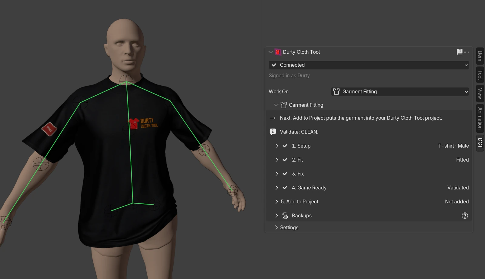
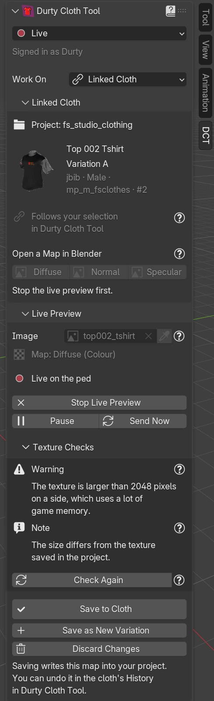
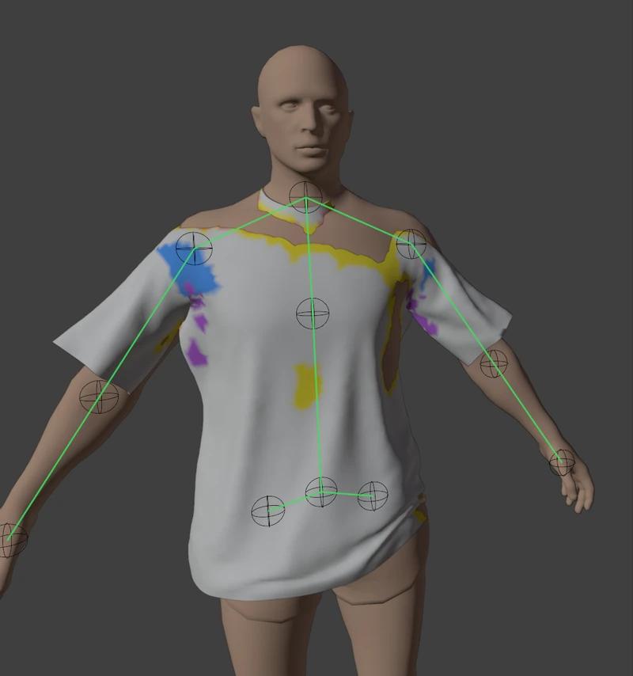
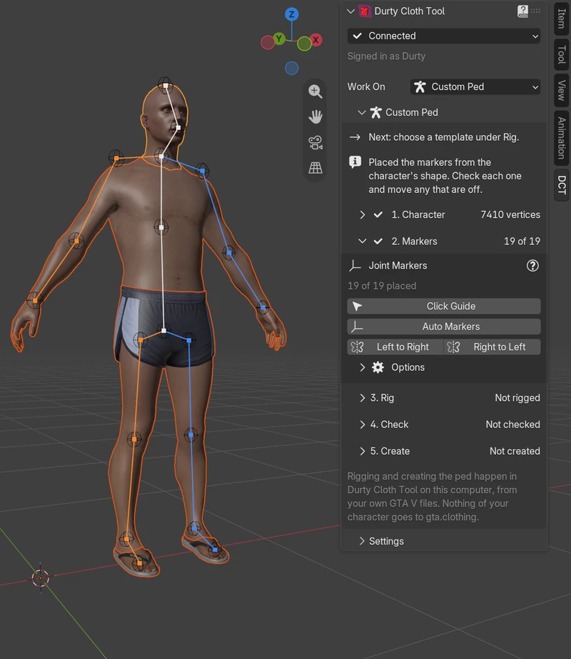

# Durty Cloth Tool Link: the Blender add-on for GTA V and FiveM clothing

**Model, paint and fit GTA 5 clothing in Blender, and see it on the ped in Durty Cloth Tool while you work.**

[Install](#-install-and-set-up) · [Getting started](#-getting-started) · [Documentation](https://docs.gta.clothing/creator-link/blender) · [Discord](https://discord.plebmasters.de) · [Releases](https://github.com/DurtyFree/durty-cloth-tool-blender/releases)

**Durty Cloth Tool Link** is the free, open-source Blender add-on for [Durty Cloth Tool](https://gta.clothing/), the
Windows app for making GTA V clothing packs for FiveM and singleplayer. As one of Durty Cloth Tool's Creator Link
plugins, it connects Blender to Durty Cloth Tool on your computer: the YDD model you edit with Sollumz and the texture
you paint show up on the ped while you work, clothing from Marvelous Designer becomes a game-ready cloth for the
freemode ped, and a character you made becomes a custom ped.

## ✨ What it does

- 🧱 **Push your model to the ped.** Select your Sollumz Drawable Dictionary and choose **Push Model**: it replaces
  the selected cloth's model in Durty Cloth Tool's 3D Preview. **Push Automatically** sends it again a moment after
  you stop editing, and **Save Model to Cloth** keeps it.
- 🎨 **Paint live on the ped.** Paint a diffuse, normal or specular map in Blender and see it on the cloth after every
  stroke. **Texture Checks** tell you what GTA V will not like before you **Save to Cloth** or **Save as New
  Variation**.
- ✏️ **Edit in connected app.** Pick a cloth in Durty Cloth Tool and open its model or its maps in Blender, already
  linked to that cloth and showing on the ped.
- 🪡 **Garment Fitting** (Experimental). Bring clothing from Marvelous Designer, CLO or any FBX, OBJ or glTF file onto
  the freemode body, **Fit on gta.clothing**, fix where it pokes through, make it game ready and **Add to Project**
  with its colour variations. Tops, jackets, dresses, trousers, skirts, shoes, masks, bags, body armour, and props such
  as hats and glasses.
- 🧍 **Custom Ped** (Experimental). Mark the joints of a human character you made, let Durty Cloth Tool rig it from an
  installed ped of your game, and create a custom ped project from it.
- ↩️ **Safe to try.** Nothing changes in your project until you save or confirm, and every save can be undone in the
  cloth's History.
- 🌍 **Nine languages.** The add-on follows Blender's interface language: English, German, French, Russian, Spanish,
  Brazilian Portuguese, Simplified Chinese, Hindi and Arabic.

 

<table>
  <tr>
    <td width="50%"></td>
    <td width="50%"></td>
  </tr>
  <tr>
    <td><b>Garment Fitting:</b> Show Problems colours the cloth: blue where a shoulder floats, purple where it is stretched and yellow where it sits too close to the body.</td>
    <td><b>Custom Ped:</b> your character with its joint markers, ready for Durty Cloth Tool to rig.</td>
  </tr>
</table>

## 📋 Requirements

- 🪟 **Windows** (64-bit), with Blender and Durty Cloth Tool on the same computer.
- 🧊 **Blender 4.2 or later**, tested with 4.5 LTS and 5.2 LTS. Garment Fitting's freemode body, and with it **Fit on
  gta.clothing** and **Transfer Weights**, needs Blender 5.2 or later.
- 👕 **[Durty Cloth Tool](https://gta.clothing/)**, a current version with your GTA V installation set up in it, for
  everything that works with a project. Custom Ped's templates and rig need GTA V Legacy.
- 👤 **A free gta.clothing account**, the same one in Blender and in Durty Cloth Tool. You sign in with Discord, as a
  member of the [Pleb Masters Community Discord](https://discord.plebmasters.de).
- 🧩 **[Sollumz](https://docs.sollumz.org/) 2.8.0 or later** (tested with 2.9.0) to push and open models, generate
  levels of detail and add clothing to a project.
- 🌐 **Allow Online Access** turned on in Blender (**Edit > Preferences > System > Network**). The connection to
  Durty Cloth Tool stays on your computer, but gta.clothing confirms your sign-in for each connection.

**Which plan do I need?** The add-on is free, and so are the Garment Fitting tools, Custom Ped's checks and markers,
and adding clothing to your project within your plan's project limits. Live Preview, Push Model, Texture Checks, Edit
in connected app and **Rig in Durty Cloth Tool** are part of Durty Cloth Tool Ultimate, and **Create Custom Ped**
needs Advanced or Ultimate. The panels say in place when something is not part of your plan. See the
[Durty Cloth Tool plans](https://gta.clothing/#pricing).

## 📦 Install and set up

**Drag into Blender (recommended).** Open the [plugins page of your gta.clothing account](https://gta.clothing/account/plugins/)
(you do not need to sign in to download), choose the **Experimental** channel while the add-on is Experimental, and
drag **Drag into Blender** onto an open Blender window twice: the first drop adds the Durty Cloth Tool extension
repository, the second installs the add-on. Blender then updates it like any other extension.

**One click from Durty Cloth Tool.** Close Blender, choose **View > Connect an app** in Durty Cloth Tool and select
**Install** on the Blender row. Durty Cloth Tool installs plugins from its own update channel, so while the add-on is
Experimental this needs Durty Cloth Tool's Experimental channel. The Blender row also offers **Drag into Blender**.

**From a file.** Download `durty_cloth_tool_link-<version>.zip` from the
[GitHub releases](https://github.com/DurtyFree/durty-cloth-tool-blender/releases) and choose **Install from Disk** in
**Edit > Preferences > Get Extensions**. Blender cannot update a copy installed this way.

To uninstall, choose **Sign Out** under **Settings > Account** in the DCT tab first, then uninstall **Durty Cloth Tool
Link** in **Get Extensions**.

## 🚀 Getting started

1. Start Durty Cloth Tool, sign in and open a project.
2. In Blender, press **N** in the 3D Viewport and open the **DCT** tab.
3. **Get Connected** finds Durty Cloth Tool by itself. Select **Sign In**, check the code Durty Cloth Tool shows and
   choose **Approve** there. You do this once per Blender installation.
4. Choose what you work on under **Work On**: **Linked Cloth** for the cloth selected in Durty Cloth Tool (**Start Live
   Preview**, or select your Drawable Dictionary and **Push Model**), **Garment Fitting** for new clothing, or **Custom
   Ped** for your own character. Garment Fitting and Custom Ped name your next step on their first line.
5. Happy with the result? Choose **Save to Cloth**, **Save Model to Cloth** or **Add to Project**. Until then, nothing
   in your project changes.

## 🚧 Limits

- Windows only, and Blender connects only to Durty Cloth Tool on the same computer.
- **Garment Fitting** and **Custom Ped** are Experimental. Results depend on how the clothing or the character was
  made, so check every result on the ped and in game before you publish it.
- Garment Fitting makes clothing for the freemode peds; clothing for custom peds is not supported. Props such as hats
  and glasses are snapped to their anchor and placed by hand, not fitted.
- **Fit on gta.clothing** and **Transfer Weights** take clothing with up to 120,000 vertices and 240,000 triangles, and
  each run uses one of the day's fits: 10 with a free account, 30 with Advanced and 100 with Ultimate.
- Live Preview images can be up to 4096 by 4096 pixels. A cloth has at most 26 colour variations, and your plan's
  project limits apply to every cloth you add.
- Custom Ped takes human characters only. The ped moves with the game animations of its template, not with your
  character's own.
- Undo in Blender does not take an added cloth out of your project; remove it in Durty Cloth Tool.

## 🔒 Privacy

Your textures, models and characters go only to Durty Cloth Tool on your computer. The one exception is **Fit on
gta.clothing** and **Transfer Weights**: once you agree, only the clothing's shape and its markers are sent to
gta.clothing, together with the fitting options you chose, and none of it is kept longer than ten minutes after the fit.
Signing in also sends your computer's name, which you can turn off with **Show This Computer's Name When Signing In**
under **Settings > Privacy**. The add-on collects no usage data; the
[Creator Link privacy page](https://docs.gta.clothing/creator-link/privacy) has the details.

## 📚 Learn more

- [The Blender add-on guide](https://docs.gta.clothing/creator-link/blender): every panel, setting and message
- [Live Preview and Models](https://docs.gta.clothing/creator-link/blender/live-preview-and-models): painting and
  pushing models for a cloth in your project
- [Garment Fitting](https://docs.gta.clothing/creator-link/blender/garment-fitting),
  [Game Ready](https://docs.gta.clothing/creator-link/blender/game-ready) and
  [Add to a Durty Cloth Tool Project](https://docs.gta.clothing/creator-link/blender/add-to-a-project): from a
  Marvelous Designer export to a new cloth in your project
- [Custom Ped](https://docs.gta.clothing/creator-link/blender/custom-ped): your own character as a custom ped
- [Blender use cases](https://docs.gta.clothing/creator-link/blender/use-cases): complete recipes, for example from a
  hoodie to your FiveM pack
- [Blender and Sollumz setup](https://docs.gta.clothing/cloth-modding/blender-and-sollumz-setup) for GTA V cloth
  modding
- [Creator Link plugins](https://gta.clothing/plugins/#plugin-blender) for Blender, Photoshop, Photopea, GIMP, Krita
  and Substance 3D Painter, with the [plugins documentation](https://docs.gta.clothing/creator-link) and its
  [troubleshooting](https://docs.gta.clothing/creator-link/troubleshooting)
- [Durty Cloth Tool](https://gta.clothing/), the FiveM clothing tool for GTA 5, and its
  [documentation](https://docs.gta.clothing/)

## 💬 Support

Ask on the [Pleb Masters Community Discord](https://discord.plebmasters.de). Choose **Copy Diagnostics** in the **?**
menu of the DCT tab and paste it with your question; it holds no file paths and no sign-in data. Bugs and ideas go to
the [GitHub issues](https://github.com/DurtyFree/durty-cloth-tool-blender/issues), and security problems are reported
privately as [SECURITY.md](SECURITY.md) explains.

## 🤝 Contributing

Fixes, translations and ideas are welcome. [CONTRIBUTING.md](CONTRIBUTING.md) explains the setup, the checks and pull
requests, and [docs/DEVELOPMENT.md](docs/DEVELOPMENT.md) how the add-on works inside.

## 📜 Licence

Copyright (c) 2026 Schmid Software Solutions ([schmid-software.de](https://schmid-software.de)). Maintained by
DurtyFree (Pleb Masters).

The add-on is free software under the GNU General Public License, version 3 or (at your option) any later version
(`GPL-3.0-or-later`, see [LICENSE](LICENSE)). The vendored `dct_link` package in `durty_cloth_tool_link/dct_link` is
MIT licensed (see its `LICENSE`). The Durty Cloth Tool logo is a mark of Schmid Software Solutions, not covered by
either licence, and may not be modified or used for any other purpose (see [NOTICE](NOTICE)). Durty Cloth Tool itself
is proprietary software, and gta.clothing is a separate service; neither is part of this repository.
